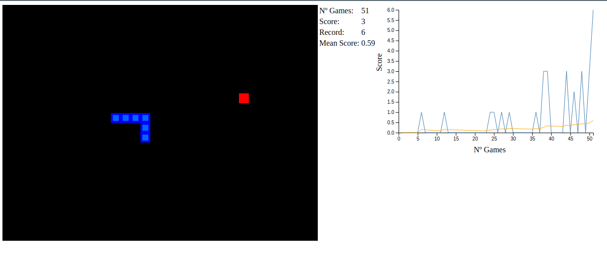
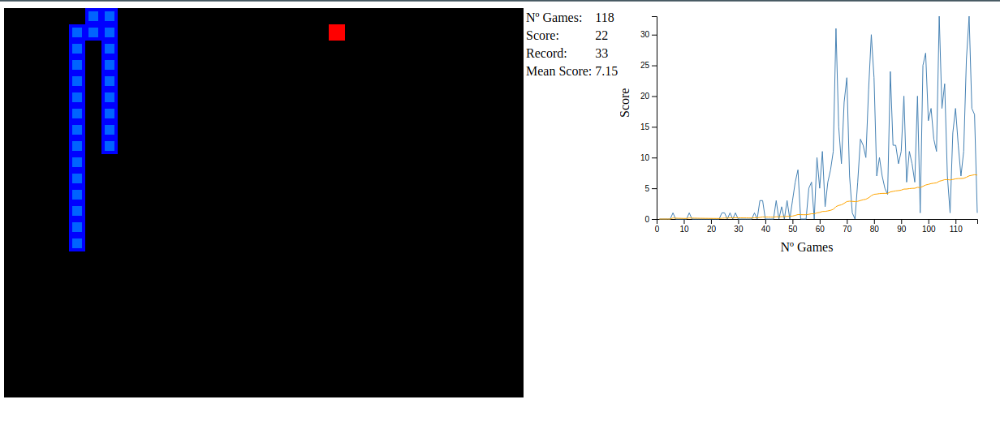

# Snake Game IA
## Criação do jogo Snake Game utilizando apenas JavaScript

Criação de um agente inteligente que aprende enquanto joga e melhora seu desempenho

Melhoras consideráveis a medida que o agente aprende mais sobre o ambiente

Referências

[Teach AI To Play Snake - Reinforcement Learning](https://www.youtube.com/playlist?list=PLqnslRFeH2UrDh7vUmJ60YrmWd64mTTKV)

[Teaching a computer how to play Snake with Q-Learning](https://towardsdatascience.com/teaching-a-computer-how-to-play-snake-with-q-learning-93d0a316ddc0)

[Teaching an AI to play Snake using Reinforcement Learning (Q-Learning).](https://medium.com/@italohdc/learnsnake-teaching-an-ai-to-play-snake-using-reinforcement-learning-q-learning-b63ac23dfdd1)